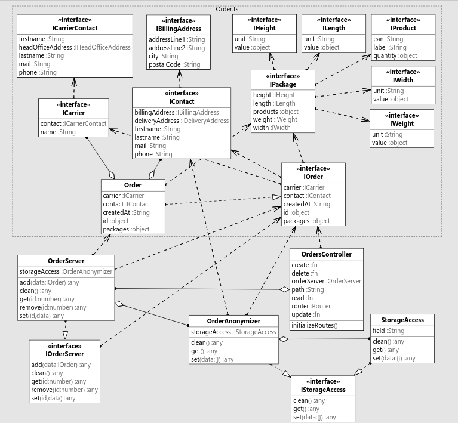

# TP OOC (Object-Oriented Concepts)

This is a practical work for the class of Object-Oriented Concepts at ISEN Lille. The goal is to explore a few design patterns while building a practical API, and practicing our Typescript skills.

- [Answers](#answers)
- [Get started](#get-started)
- [Running a command in a running container](#running-a-command-in-a-running-container)
- [Running a command in a stopped/failed container](#running-a-command-in-a-stoppedfailed-container)
- [Access your container](#access-your-container)

---

## Answers

1. For this exercise, I chose to write a RESTful-compliant API. It is a little bit dirty but commented. I'll leave more room for improvements in the next exercises.
2. To compose this model, we need to respect the interface segregation principle. We can describe the data with a bunch of interfaces nested into each other.
3. To seperate the service part from the HTTP part, we need to respect the single-responsibility principle. We'll use a light implementation of the `Repository Pattern`, with the `StorageAccess` accessing and mapping the data to real objects, and the `OrderServer` handling all the business logic.
4. To anonymize our contact data, we'll use the `Proxy Pattern`. By adding an `IStorageAccess` interface to our `StorageAccess`, we will allow the creation of a new class `OrderAnonymizer` that will implements `IStorageAccess` and will replace `storageAccess` in our `OrderServer` class. `OrderAnonymizer` itself is just calling an `AccessStorage` object except for the `get()` function where it will alterate the data to remove contacts informations.
5. I don't see much to do here, I don't really want my `Order` class to manage the Redis connection, it seems to make no sense.
6. See below for the class diagram



---

## Get started

Ensure you have `make` installed on your system.

After cloning the repository, run:

```bash
make init
```

Now you can `start|stop|restart` your server by running:

```bash
make start|stop|restart
```

Your server will listen by default on port `1337` of your `$DOCKER_HOST`

You can access the server logs by running:

```bash
make log
```

If you want to stop and destroy your docker containers:

```bash
make down
```

Launch dependencies install with:

```bash
make install
```

## Running a command in a running container

To run a command in your container, run the following:

```bash
docker exec <container_name> <command>
```

## Running a command in a stopped/failed container

You will have to run a command through `docker-compose`:

```bash
docker-compose run --rm <service_name> <command>
```

## Access your container

To connect to a container, run:

```bash
docker exec -ti <container_name> sh
```
